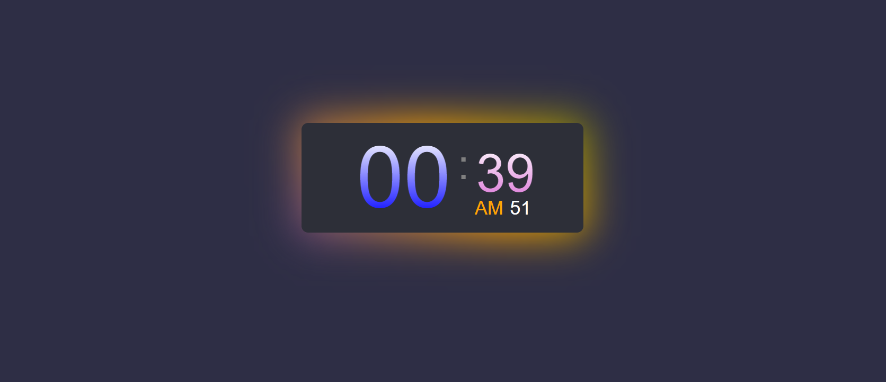

# Digital Clock 🕰️

This is a digital clock made using HTML, CSS and JavaScript. It is a simple project that can be used as a reference for beginners.

## Features

- Displays the current time

## Technologies

- HTML
- CSS
- JavaScript

## Screenshots

